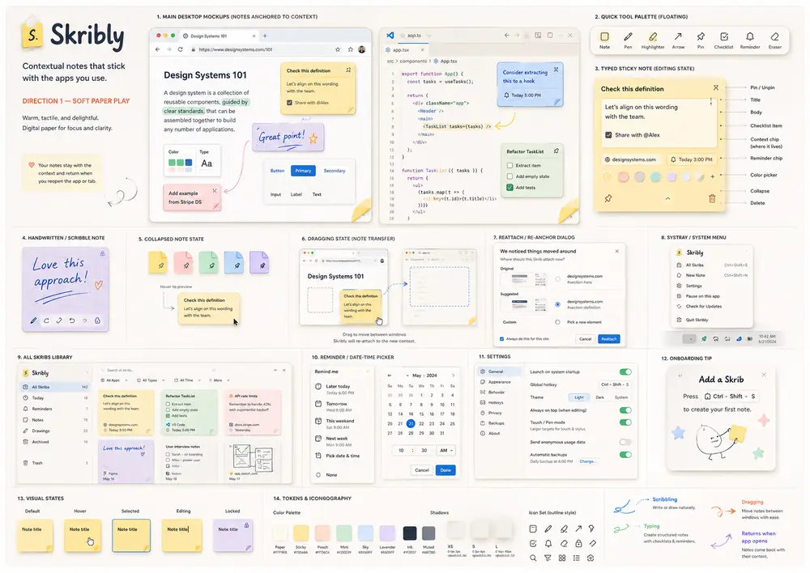

# Selected design direction: Soft Paper Play

## Intent

Skribli should feel tactile, warm, immediate, and lightweight—like physical paper translated carefully into a digital environment. It must remain playful without becoming childish or visually noisy.

## Visual characteristics

- warm paper/off-white base
- pale yellow as the default sticky color
- peach, mint, sky, and lavender alternatives
- dark ink rather than pure black
- soft elevation shadows
- small asymmetry and folded corners
- handwritten accents only where they add humanity
- crisp system typography for functional controls
- minimal chrome when a Skrib is inactive

## Motion

Current product motion is brief, functional, and reduced or removed when Windows requests reduced motion:

- compact surfaces appear without a long entrance sequence;
- button, selection, confirmation, loading, and save-state feedback remains subtle;
- All Skribs, Trash, onboarding, and import transitions remain restrained while the active collapsed Skrib uses one quiet pastel dot;
- no idle looping animations.

Collapse/restore and the drawing workspace use only short functional state changes. Peel/unfold, persistent-note hover animation, richer anchor-placement motion, and gesture choreography remain deferred research.

## Design constraints

- Never cover underlying content unnecessarily.
- The transient compact editor uses only its visible window bounds; there is no interactive full-screen overlay.
- Completing the editor durably saves and collapses the active Skrib into one movable pastel dot; clicking it restores the same Skrib.
- The current single-window runtime shows one active editor or collapsed dot, not an unlimited desktop widget layer.
- The blank folded-note mark keeps the warm paper/yellow/ink palette, uses soft rounded corners, and contains no letterform.
- Notes must remain readable at different DPI scales.
- Keyboard focus, forced colours, reduced motion, and larger text must remain legible without changing the brand language.
- Dark mode may be added later; the approved initial direction is light Soft Paper Play.
